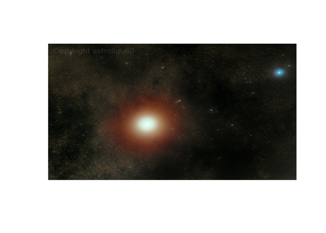

<!-- README.md is generated from README.Rmd. Please edit that file -->

# nasaR

<!-- badges: start -->

<!-- badges: end -->

The goal of nasaR is to provide useful functions to help access NASA
data easily.

## Installation

1.  You can install the released version of nasaR from
    [github](https://github.com/Liu-Zhichao/nasaR) with:

<!-- end list -->

``` r
devtools::install_github("Liu-Zhichao/nasaR")
```

2.  You can get your own NASA API token at:
    [NASA\_API](https://api.nasa.gov/). It is highly recommended that
    you place your private token in the R environment file, and name it
    “NASA\_TOKEN”. (the usethis::edit\_r\_environ() function will be
    useful). It could help your access to the data be much safer and
    faster.

## Examples

These are some basic examples which show you how to get access to the
data you want:

``` r
library(nasaR)
## Download an high-definition astronomy picture of 2019/11/01 and return its explanation text as well.
APOD(date = as.Date("2019-11-01"), hd = TRUE, return_text = TRUE)
```



    #> [1] "October 31, 1938 was the day after Martians encountered planet Earth, and everything was calm. Reports of the invasion were revealed to be part of a Halloween radio drama, the now famous broadcast based on H.G. Wells' scifi novel War of the Worlds. On Mars October 20, 2014 was calm too, the day after its close encounter with Comet Siding Spring (C/2013 A1). Not a hoax, this comet really did come within 86,700 miles or so of Mars, about 1/3 the Earth-Moon distance. Earth's spacecraft and rovers in Mars orbit and on the surface reported no ill effects though, and had a ringside seat as a visitor from the outer solar system passed by. Spanning over 2 degrees against stars of the constellation Ophiuchus, this colorful telescopic snapshot captures our view of Mars on the day after. Bluish star 51 Ophiuchi is at the upper right and the comet is just emerging from the Red Planet's bright glare."

``` r
## Return info of technology which NASA is working on since 2019/12/01.
Techport(update_since = as.Date("2019-12-01"))
#> $projects
#> $projects$totalCount
#> [1] 20
#> 
#> $projects$projects
#> $projects$projects[[1]]
#> $projects$projects[[1]]$id
#> [1] 93127
#> 
#> $projects$projects[[1]]$lastUpdated
#> [1] "2019-12-6"
#> 
#> 
#> $projects$projects[[2]]
#> $projects$projects[[2]]$id
#> [1] 95917
#> 
#> $projects$projects[[2]]$lastUpdated
#> [1] "2019-12-3"
#> 
#> 
#> $projects$projects[[3]]
#> $projects$projects[[3]]$id
#> [1] 95885
#> 
#> $projects$projects[[3]]$lastUpdated
#> [1] "2019-12-3"
#> 
#> 
#> $projects$projects[[4]]
#> $projects$projects[[4]]$id
#> [1] 95884
#> 
#> $projects$projects[[4]]$lastUpdated
#> [1] "2019-12-3"
#> 
#> 
#> $projects$projects[[5]]
#> $projects$projects[[5]]$id
#> [1] 95883
#> 
#> $projects$projects[[5]]$lastUpdated
#> [1] "2019-12-3"
#> 
#> 
#> $projects$projects[[6]]
#> $projects$projects[[6]]$id
#> [1] 95882
#> 
#> $projects$projects[[6]]$lastUpdated
#> [1] "2019-12-3"
#> 
#> 
#> $projects$projects[[7]]
#> $projects$projects[[7]]$id
#> [1] 95881
#> 
#> $projects$projects[[7]]$lastUpdated
#> [1] "2019-12-3"
#> 
#> 
#> $projects$projects[[8]]
#> $projects$projects[[8]]$id
#> [1] 95880
#> 
#> $projects$projects[[8]]$lastUpdated
#> [1] "2019-12-3"
#> 
#> 
#> $projects$projects[[9]]
#> $projects$projects[[9]]$id
#> [1] 95879
#> 
#> $projects$projects[[9]]$lastUpdated
#> [1] "2019-12-3"
#> 
#> 
#> $projects$projects[[10]]
#> $projects$projects[[10]]$id
#> [1] 95878
#> 
#> $projects$projects[[10]]$lastUpdated
#> [1] "2019-12-3"
#> 
#> 
#> $projects$projects[[11]]
#> $projects$projects[[11]]$id
#> [1] 95877
#> 
#> $projects$projects[[11]]$lastUpdated
#> [1] "2019-12-3"
#> 
#> 
#> $projects$projects[[12]]
#> $projects$projects[[12]]$id
#> [1] 95876
#> 
#> $projects$projects[[12]]$lastUpdated
#> [1] "2019-12-3"
#> 
#> 
#> $projects$projects[[13]]
#> $projects$projects[[13]]$id
#> [1] 95874
#> 
#> $projects$projects[[13]]$lastUpdated
#> [1] "2019-12-3"
#> 
#> 
#> $projects$projects[[14]]
#> $projects$projects[[14]]$id
#> [1] 95872
#> 
#> $projects$projects[[14]]$lastUpdated
#> [1] "2019-12-3"
#> 
#> 
#> $projects$projects[[15]]
#> $projects$projects[[15]]$id
#> [1] 95916
#> 
#> $projects$projects[[15]]$lastUpdated
#> [1] "2019-12-3"
#> 
#> 
#> $projects$projects[[16]]
#> $projects$projects[[16]]$id
#> [1] 95913
#> 
#> $projects$projects[[16]]$lastUpdated
#> [1] "2019-12-3"
#> 
#> 
#> $projects$projects[[17]]
#> $projects$projects[[17]]$id
#> [1] 95912
#> 
#> $projects$projects[[17]]$lastUpdated
#> [1] "2019-12-3"
#> 
#> 
#> $projects$projects[[18]]
#> $projects$projects[[18]]$id
#> [1] 95909
#> 
#> $projects$projects[[18]]$lastUpdated
#> [1] "2019-12-3"
#> 
#> 
#> $projects$projects[[19]]
#> $projects$projects[[19]]$id
#> [1] 95908
#> 
#> $projects$projects[[19]]$lastUpdated
#> [1] "2019-12-3"
#> 
#> 
#> $projects$projects[[20]]
#> $projects$projects[[20]]$id
#> [1] 95907
#> 
#> $projects$projects[[20]]$lastUpdated
#> [1] "2019-12-3"
```

## Announcement

R CRAN has an official NASA API interface package called
[nasadata](https://cran.r-project.org/web/packages/nasadata/nasadata.pdf).
However, the version is quite old and has no longer been updated since
2016, and the functions in this package only take the Earth into
consideration, info about other planets/objects in the space are not
included in the package. So I decide to make an update(includes all the
contents nasadata has and more) and build up various functions for
acquiring NASA data easily from available APIs as complete as possible.
Find more info about changes/updates in the vignette file.

## Find Out More

You can find lots of useful helper documents in nasaR package. If you
don’t know meaning of some specific functions, you could check [NASA API
official website](https://api.nasa.gov/) for detailed information. I
believe that you can find the solution there. If you find any questions
or have some interesting new idea of the package, feel free to contact
the [author](https://www.linkedin.com/in/zhichao-liu/) directly or leave
an issue [here](https://github.com/Liu-Zhichao/nasaR/issues). Thank
you\!
