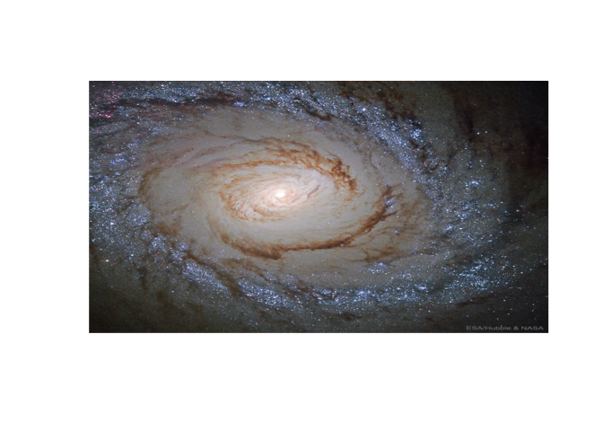

<!-- README.md is generated from README.Rmd. Please edit that file -->

# nasaR

<!-- badges: start -->

<!-- badges: end -->

The goal of nasaR is to provide useful functions to help access NASA
data easily.

## Installation

1.  You can install the released version of nasaR from
    [github](https://github.com/Liu-Zhichao/nasaR) with:

<!-- end list -->

``` r
devtools::install_github("Liu-Zhichao/nasaR")
# If you want to read the vignettes of the package by:
browseVignettes("nasaR")
# Then you should use option "build_vignettes = TRUE":
devtools::install_github("Liu-Zhichao/nasaR", build_vignettes = TRUE)
```

2.  You can get your own NASA API token at:
    [NASA\_API](https://api.nasa.gov/). It is highly recommended that
    you place your private token in the R environment file, and name it
    “NASA\_TOKEN”. (the usethis::edit\_r\_environ() function will be
    useful). It could help your access to the data be much safer and
    faster.

## Examples

These are some basic examples which show you how to get access to the
data you want:

``` r
library(nasaR)
## Download an HD astronomy picture of 2019/12/01 and return its explanation text as well.
APOD(date = as.Date("2019-12-01"), hd = TRUE, return_text = TRUE)
```



    #> [1] "Why does this galaxy have a ring of bright blue stars?  Beautiful island universe Messier 94 lies a mere 15 million light-years distant in the northern constellation of the Hunting Dogs (Canes Venatici). A popular target for Earth-based astronomers, the face-on spiral galaxy is about 30,000 light-years across, with spiral arms sweeping through the outskirts of its broad disk. But this Hubble Space Telescope field of view spans about 7,000 light-years across M94's central region. The featured close-up highlights the galaxy's compact, bright nucleus, prominent inner dust lanes, and the remarkable bluish ring of young massive stars. The ring stars are all likely less than 10 million years old, indicating that M94 is a starburst galaxy that is experiencing an epoch of rapid star formation from inspiraling gas. The circular ripple of blue stars is likely a wave propagating outward, having been triggered by the gravity and rotation of a oval matter distributions. Because M94 is relatively nearby, astronomers can better explore details of its starburst ring.    Astrophysicists: Browse 2,000+ codes in the Astrophysics Source Code Library"

``` r
## Return info of technology which NASA is working on since 2019/12/01.
Techport(update_since = as.Date("2019-12-01"))
#> $projects
#> $projects$totalCount
#> [1] 21
#> 
#> $projects$projects
#> $projects$projects[[1]]
#> $projects$projects[[1]]$id
#> [1] 95074
#> 
#> $projects$projects[[1]]$lastUpdated
#> [1] "2019-12-9"
#> 
#> 
#> $projects$projects[[2]]
#> $projects$projects[[2]]$id
#> [1] 93127
#> 
#> $projects$projects[[2]]$lastUpdated
#> [1] "2019-12-6"
#> 
#> 
#> $projects$projects[[3]]
#> $projects$projects[[3]]$id
#> [1] 95917
#> 
#> $projects$projects[[3]]$lastUpdated
#> [1] "2019-12-3"
#> 
#> 
#> $projects$projects[[4]]
#> $projects$projects[[4]]$id
#> [1] 95885
#> 
#> $projects$projects[[4]]$lastUpdated
#> [1] "2019-12-3"
#> 
#> 
#> $projects$projects[[5]]
#> $projects$projects[[5]]$id
#> [1] 95884
#> 
#> $projects$projects[[5]]$lastUpdated
#> [1] "2019-12-3"
#> 
#> 
#> $projects$projects[[6]]
#> $projects$projects[[6]]$id
#> [1] 95883
#> 
#> $projects$projects[[6]]$lastUpdated
#> [1] "2019-12-3"
#> 
#> 
#> $projects$projects[[7]]
#> $projects$projects[[7]]$id
#> [1] 95882
#> 
#> $projects$projects[[7]]$lastUpdated
#> [1] "2019-12-3"
#> 
#> 
#> $projects$projects[[8]]
#> $projects$projects[[8]]$id
#> [1] 95881
#> 
#> $projects$projects[[8]]$lastUpdated
#> [1] "2019-12-3"
#> 
#> 
#> $projects$projects[[9]]
#> $projects$projects[[9]]$id
#> [1] 95880
#> 
#> $projects$projects[[9]]$lastUpdated
#> [1] "2019-12-3"
#> 
#> 
#> $projects$projects[[10]]
#> $projects$projects[[10]]$id
#> [1] 95879
#> 
#> $projects$projects[[10]]$lastUpdated
#> [1] "2019-12-3"
#> 
#> 
#> $projects$projects[[11]]
#> $projects$projects[[11]]$id
#> [1] 95878
#> 
#> $projects$projects[[11]]$lastUpdated
#> [1] "2019-12-3"
#> 
#> 
#> $projects$projects[[12]]
#> $projects$projects[[12]]$id
#> [1] 95877
#> 
#> $projects$projects[[12]]$lastUpdated
#> [1] "2019-12-3"
#> 
#> 
#> $projects$projects[[13]]
#> $projects$projects[[13]]$id
#> [1] 95876
#> 
#> $projects$projects[[13]]$lastUpdated
#> [1] "2019-12-3"
#> 
#> 
#> $projects$projects[[14]]
#> $projects$projects[[14]]$id
#> [1] 95874
#> 
#> $projects$projects[[14]]$lastUpdated
#> [1] "2019-12-3"
#> 
#> 
#> $projects$projects[[15]]
#> $projects$projects[[15]]$id
#> [1] 95872
#> 
#> $projects$projects[[15]]$lastUpdated
#> [1] "2019-12-3"
#> 
#> 
#> $projects$projects[[16]]
#> $projects$projects[[16]]$id
#> [1] 95916
#> 
#> $projects$projects[[16]]$lastUpdated
#> [1] "2019-12-3"
#> 
#> 
#> $projects$projects[[17]]
#> $projects$projects[[17]]$id
#> [1] 95913
#> 
#> $projects$projects[[17]]$lastUpdated
#> [1] "2019-12-3"
#> 
#> 
#> $projects$projects[[18]]
#> $projects$projects[[18]]$id
#> [1] 95912
#> 
#> $projects$projects[[18]]$lastUpdated
#> [1] "2019-12-3"
#> 
#> 
#> $projects$projects[[19]]
#> $projects$projects[[19]]$id
#> [1] 95909
#> 
#> $projects$projects[[19]]$lastUpdated
#> [1] "2019-12-3"
#> 
#> 
#> $projects$projects[[20]]
#> $projects$projects[[20]]$id
#> [1] 95908
#> 
#> $projects$projects[[20]]$lastUpdated
#> [1] "2019-12-3"
#> 
#> 
#> $projects$projects[[21]]
#> $projects$projects[[21]]$id
#> [1] 95907
#> 
#> $projects$projects[[21]]$lastUpdated
#> [1] "2019-12-3"
```

## Announcement

R CRAN has an official NASA API interface package called
[nasadata](https://cran.r-project.org/web/packages/nasadata/index.html).
However, the version is quite old and has no longer been updated since
2016, and the functions in this package only take the Earth into
consideration, info about other planets/objects in the space are not
included in the package. So I decide to make an update(includes all the
contents nasadata has and more) and build up various functions for
acquiring NASA data easily from available APIs as complete as possible.
Although a few functions seems to be similar in two
packages(e.g. Earth\_Assets in nasaR v.s. earth\_assets in nasadata), I
wrote all the functions myself without any references. Find more info
about similarities/updates in the vignette file.

## Find Out More

You can find lots of useful helper documents in nasaR package. If you
don’t know meaning of some specific functions, you could check [NASA API
official website](https://api.nasa.gov/) for detailed information. I
believe that you can find the solution there. If you find any questions
or have some interesting new idea of the package, feel free to contact
the [author](https://www.linkedin.com/in/zhichao-liu/) directly or leave
an issue [here](https://github.com/Liu-Zhichao/nasaR/issues). Thank
you\!
